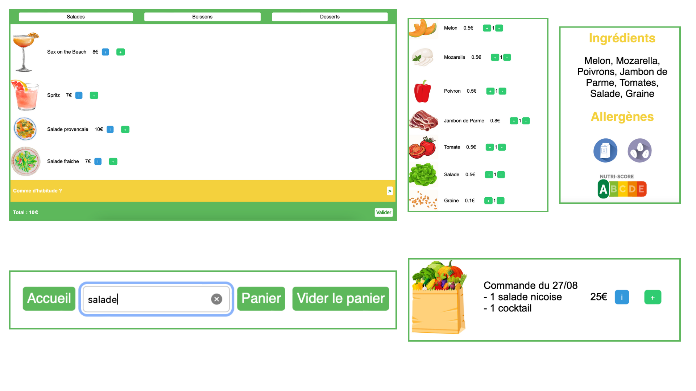

# IGR203
IGR203 User-Centered Design Projet

## Description :
Le projet consiste à concevoir un menu interactif de restaurant. Nous avons choisi de proposer un bar à salades tout en concevant un menu similaire à l’interface d’un fast-food. Inspiré par la tendance croissante de la restauration rapide saine et personnalisée, le contexte de ce projet repose sur la volonté de répondre à la demande des consommateurs en proposant une expérience conviviale et intuitive. En combinant l'efficacité d'un terminal de commande rapide, constitué d’un programme de fidélité, avec la fraîcheur et la personnalisation des ingrédients d'un bar à salades, l'objectif est de créer une expérience culinaire moderne et satisfaisante pour les clients.


## Fonctionnalités :

-Menu interactif

-Personnalisation de salade

-Système de fidélité

-Habitude du client enregistrées 

-Barre de recherche

-Choix de la langue


Screens des principales fonctionnalités 

## Languages utilisés :
HTML : structure de base du site
CSS : Pour le design
JavaScript : Pour la logique interactive du menu et du système de panier

## Organisation du code
Les pages html sont toutes dans le dossier source avec le serveur.js qui permet de lancer le serveur
Des dossiers css et js regroupent les fichiers en question associés aux pages web
Un dossier json regroupe les dictionnaires utilisés pour la traduction du site
Finalement un dossier media regroupe les images utilisées au travers des pages

Comme nous n'avons pas implémenté de database (ce n'étais pas le but de l'exercice), certaines pages ont été dupliquées et hardcoded. Cette structure de code peu élégante pourra être améliorée lors de l'introduction d'une base de donées structurée dans des fichiers Json. Le code devrait être facilement adaptable. 
Les données (comme le total ou les plats sélectionnés) sont enregistrées en local mais pourrait à l'aide d'une base de donée être enregistré sur un server. 

## Cloner le dépot:
```bash
git clone https://github.com/Surimi91/IGR203.git
```

## Lancement du projet:
1. Se rendre dans le terminal
2. cd dans le dossier
3. node serveur.js
4. Le serveur est desormais en ligne sur votre réseau local, accezdez-y via votre ip + port :3000

0. Autre méthode : ouvrir avec le live server VSCode


## Contributions :
Les contributions sont toujours les bienvenues ! Veuillez forker le dépôt et ouvrir une pull request avec vos modifications ou nouvelles fonctionnalités. N'oubliez pas de mettre à jour le README si nécessaire.


Projet réalisé par Servane Desvignes, Marie Pizzini et Celio Boulay dans le cadre d'un cours d'User Centered Design à Telecom Paris
